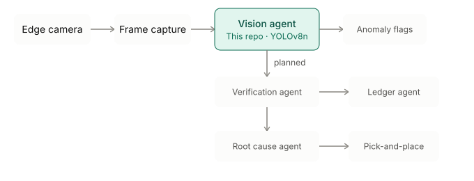

 
  
  # SolderMind
  AI PCB Quality Assurance

---
## Overview
This repository implements an **AI Automated PCB Quality assurance solution** for industrial environments. Legacy Automated Optical Inspection (LAOI) systems in PCB manufacturing use rigid, rule based algorithms that fails to adapt to natural production variances. SolderMind replaces static thresholds with an autonomous multi agent pipeline that handels the defect lifecycle to detection to live recallibration.

The model was finetuned from COCO pretrained YOLOv8n weights using standard transfer learning. Training used default batch sampling provided by ultralytics.

- This repo implements the vision agent of the pipeline, which responsible for flag structural anomalies down to the micron layer, ignoring ambient lighting drift.

 

 

## Training pipeline

## Dataset

The model was trained on [roboflow PCB Defect detection dataset (V2)](https://universe.roboflow.com/uni-4sdfm/pcb-defects)

##### Class Distribution:
 
| **Class** | **Sample size** | 
| --------------- | --------------- |
| Defect 01    | - | 
| Defect 02   | -   | 
| Defect 03   | -    | 
| Defect 04   | -   | 
| Defect 05   | -  | 
| Defect 06   | - | 
| Defect 07   | -  | 

Dataset split: 522 images for training set, 48 images for valid set, 38 images for test set

##### Preprocessing:

-  Images resized to 640*640
-  Applied auto orient.

## Model Selection

Considering the limited storage and RAM footprint, chose Yolo v8 Nano model for edge deployment.

## Evaluations

| **Metric** | **Training** | **Testing** |
| --------------- | --------------- |------------|
| Precision    | 0.9950   | 0.9904 |
| Recall    | 1.0    | 0.9951 |
| mAP@50    | 0.995    | 0.9946 |
| mAP@50-95    | 0.8354 | 0.8214 |

